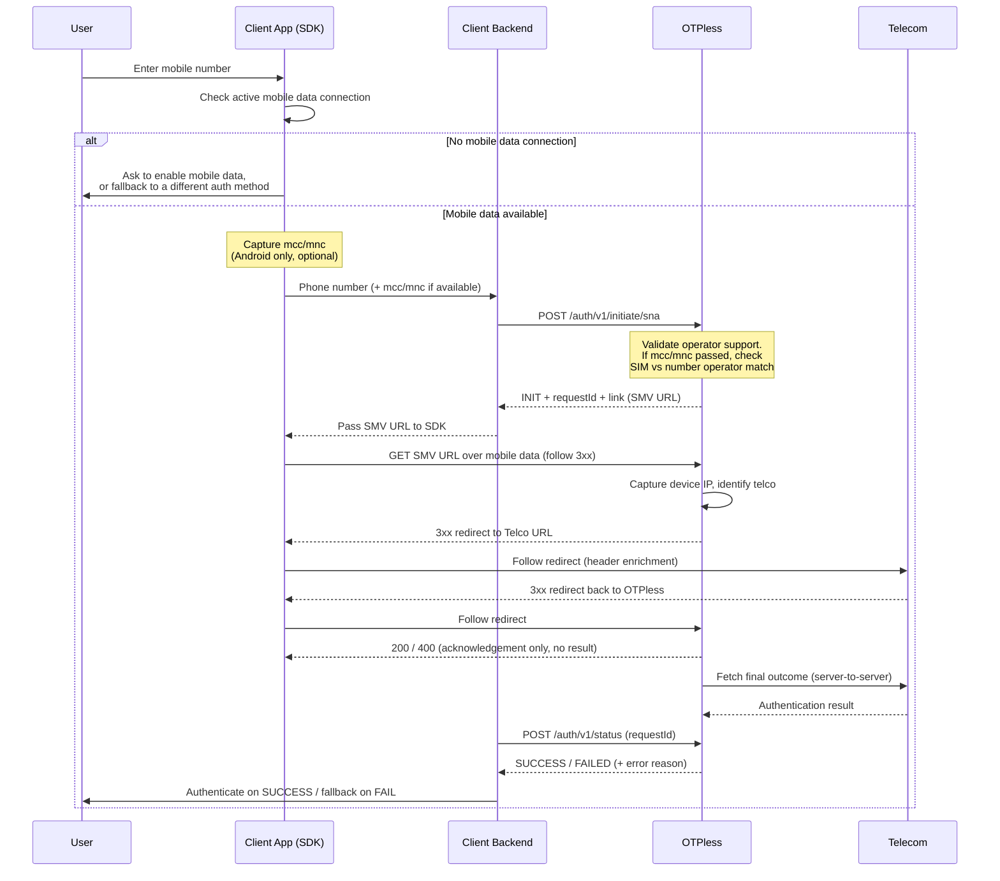

> ## Documentation Index
>
> Fetch the complete documentation index at: https://otpless.com/docs/llms.txt
> Use this file to discover all available pages before exploring further.

# Overview

> Authenticate a user's mobile number through the telecom network without OTP. Integration guide for the hybrid client + backend SNA flow.

## Overview

OTPless SNA is a **hybrid client + backend flow**:

- Your **client backend** creates and checks the transaction.
- Your **client app** opens the SMV URL on the user's device over **mobile data**.

This document explains the integration model, flow, and implementation guidance. For request/response details, use the endpoint reference:

- [Initiate SNA](/api-reference/endpoint/sign-in/sna/initiate-sna) — `POST /auth/v1/initiate/sna`
- [Check SNA status](/api-reference/endpoint/sign-in/sna/status) — `POST /auth/v1/status`

## Who should use this

Use this API if you want to verify a user's phone number with:

- lower friction than SMS OTP
- faster completion time
- stronger SIM/network-bound verification
- telecom-based silent authentication on supported operators

Best suited for: login and signup, repeat user verification, checkout and payment-related authentication, step-up verification flows.

## How SNA works

Silent Network Authentication verifies whether the **device currently using the mobile network** is associated with the phone number being verified. The telecom operator validates the request using network and SIM context, so SNA is **not a backend-only flow**.

<Warning>
  The `link` (SMV URL) returned by the Initiate API **must be opened from the user's device using mobile data**. If it is opened from your backend, a server, a desktop browser, or Wi‑Fi, the SNA verification may fail.
</Warning>

## Integration architecture

**Client Backend:** Call Initiate and Status APIs, handle credentials, store `requestId`, pass the SMV URL to the client, make the final login/signup decision.

**Client:** Collect phone number, check for an active mobile data connection (fallback to a different auth method if absent), capture `mcc`/`mnc` where available (Android only, optional), open the SMV URL on the user's device over mobile data, and follow the redirect chain.

## End-to-end flow

<Steps>
  <Step title="User enters number">The user enters their mobile number in your app.</Step>
  <Step title="Check data connection">The client checks the device has an active mobile data connection. If not, prompt the user to enable mobile data or fallback to a different auth method.</Step>
  <Step title="Capture network context">Where available, the client captures `mcc` and `mnc` (Android only, optional).</Step>
  <Step title="Send to backend">The client sends the phone number (and `mcc`/`mnc` if available) to your backend.</Step>
  <Step title="Backend calls Initiate">Your backend calls [Initiate SNA](/api-reference/endpoint/sign-in/sna/initiate-sna) (`POST /auth/v1/initiate/sna`).</Step>
  <Step title="Handle response">OTPless validates operator support and returns `INIT` (with `requestId` and a `link` / SMV URL) or `FAILED` (with `error`).</Step>
  <Step title="Open SMV URL on device">Your backend passes the SMV URL to the client, which opens it over mobile data and follows the redirect chain.</Step>
  <Step title="Telecom verification">The telecom operator enriches the request and performs silent SIM/network verification. OTPless then fetches the final outcome from the operator server-to-server.</Step>
  <Step title="Check status">Backend or client calls the [Status API](/api-reference/endpoint/sign-in/sna/status) with `requestId`.</Step>
  <Step title="Complete auth">If final status is `SUCCESS`, authenticate the user; otherwise fallback.</Step>
</Steps>

## Sequence diagram

## Base URL and authentication

**Base URL (production):** `https://user-auth.otpless.app`

**Headers (all requests):** `clientId`, `clientSecret`, `Content-Type: application/json`. Invalid or missing credentials return `401 Unauthorized`.

## API overview

| Endpoint                | Method | Purpose                               |
| ----------------------- | ------ | ------------------------------------- |
| `/auth/v1/initiate/sna` | `POST` | Creates an SNA transaction            |
| `/auth/v1/status`       | `POST` | Fetches the latest transaction result |

## Getting the result

The SNA flow does not return the verification result to the client. After the client opens the SMV URL and follows the redirect chain, it receives only an acknowledgement (HTTP `200` or `400`) with no result. OTPless fetches the final outcome from the operator server-to-server.

<Warning>
  Always call the [Status API](/api-reference/endpoint/sign-in/sna/status) with `requestId` to get the final result. It is the only source of truth.
</Warning>

## Response objects

The API may return **phoneDetail**, **simDetail**, **networkDetail**, and **error** objects. See the [Initiate SNA](/api-reference/endpoint/sign-in/sna/initiate-sna) and [Check SNA status](/api-reference/endpoint/sign-in/sna/status) pages for field details.

## Error model

- **Request-level:** Validation or auth failures (e.g. invalid phone, missing credentials) → HTTP `400` or `401`.
- **Transaction-level:** API call succeeds but SNA fails (e.g. unsupported operator) → HTTP `200` with `status = FAILED` and an `error` object in the body.

## HTTP status codes

| HTTP  | Meaning                                         |
| ----- | ----------------------------------------------- |
| `200` | Request accepted. Check response body `status`. |
| `400` | Invalid request or validation error             |
| `401` | Authentication failure                          |

## Error codes

See the endpoint pages for full lists. Summary: **7012**, **7002** (auth); **7101**, **7102**, **7106**, **7113**, **7123**, **7124**, **7160** (Initiate); **7119**, **7114**, **7301** (Status); **SP4xxxx**, **SP5xxxx** (transaction failure).

## Recommended integration pattern

<Steps>
  <Step title="Collect phone number">Capture the user's mobile number in your app.</Step>
  <Step title="Check data connection">Confirm the device is on mobile data. If not, prompt the user to enable it or fallback to a different auth method.</Step>
  <Step title="Collect network context">On Android, optionally collect `mcc` and `mnc`.</Step>
  <Step title="Initiate from backend">Call `POST /auth/v1/initiate/sna`.</Step>
  <Step title="Open SMV URL on device">If status is INIT, pass the SMV URL to the client and open it over mobile data, following the redirect chain.</Step>
  <Step title="Fetch final result">Call `POST /auth/v1/status` with `requestId`.</Step>
  <Step title="Complete login">Authenticate only if status is `SUCCESS`.</Step>
</Steps>

## Polling guidance

Start polling after the SMV URL is opened. Poll every 2–3 seconds. Stop on `SUCCESS`, `FAILED`, or `EXPIRED`, or after a 30–60 second timeout. Do not poll aggressively.

## Best practices

- Store the **requestId** from the Initiate response.
- Pass **correlationId** to map the transaction to your session.
- Open the **SMV URL** only on the user's device over mobile data.
- Treat the **Status API** as the source of truth for the final result.
- Provide a **fallback** to a different auth method when SNA is unavailable.

## Common failure scenarios

SNA may fail when: device is on Wi‑Fi not mobile data, active SIM does not match the number, operator unsupported or not enabled, SIM inactive or suspended, transaction expired, or network identity cannot be resolved.

## Minimal implementation checklist

- [ ] Client checks for an active mobile data connection before starting SNA
- [ ] Backend calls Initiate with valid credentials and stores `requestId`
- [ ] Client can open the returned SMV URL over mobile data
- [ ] Backend calls Status API; app authenticates only on final `SUCCESS`
- [ ] Fallback to a different auth method exists for non-SNA cases

## Support

For access, configuration (e.g. SNA enabled for your account), base URL, or credentials, contact [help@otpless.com](mailto:help@otpless.com) or refer to your onboarding documentation.

## Related references

<CardGroup cols={2}>
  <Card title="Initiate SNA" icon="play" href="/api-reference/endpoint/sign-in/sna/initiate-sna">
    `POST /auth/v1/initiate/sna` — create an SNA transaction.
  </Card>

  <Card title="Check SNA status" icon="circle-check" href="/api-reference/endpoint/sign-in/sna/status">
    `POST /auth/v1/status` — fetch the final result.
  </Card>

  <Card title="SNA Webhook" icon="webhook" href="/api-reference/endpoint/sign-in/sna/webhook">
    Webhook event reference and payload structure.
  </Card>

  <Card title="Errors" icon="triangle-exclamation" href="/api-reference/endpoint/sign-in/sna/errors">
    SNA error codes and response formats.
  </Card>
</CardGroup>
