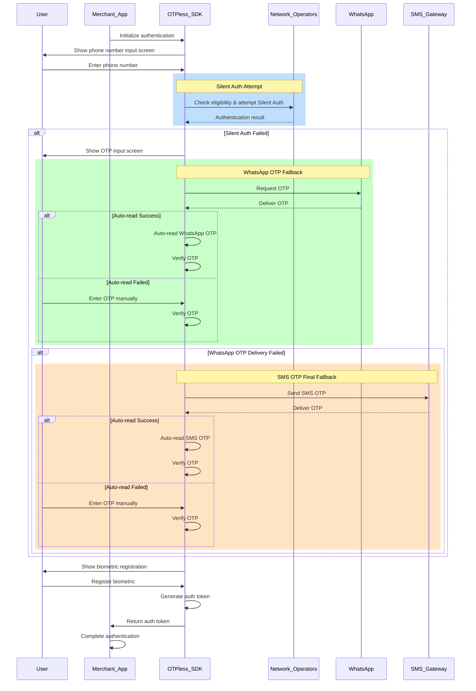
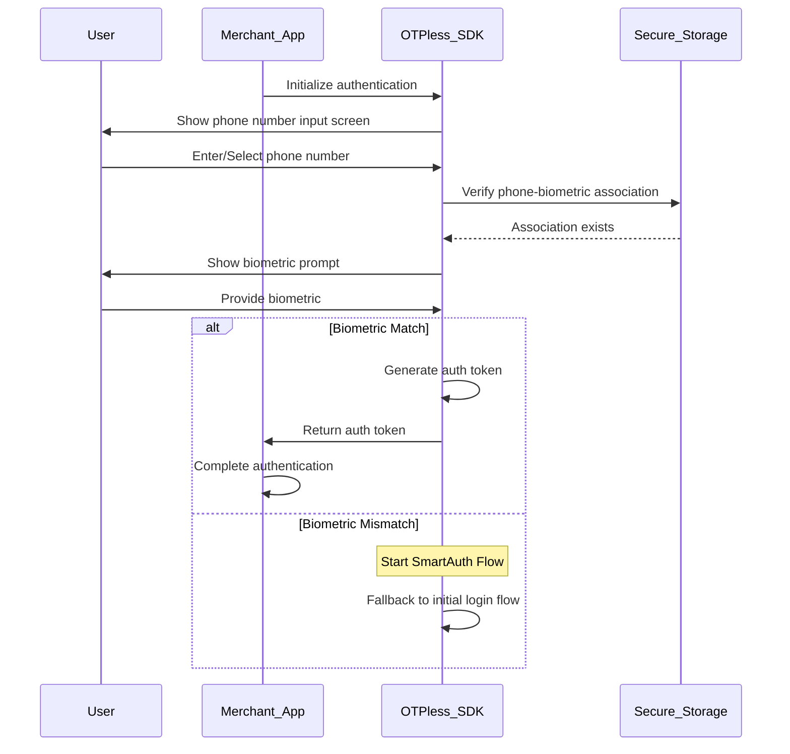

> ## Documentation Index
>
> Fetch the complete documentation index at: https://otpless.com/docs/llms.txt
> Use this file to discover all available pages before exploring further.

# Cost Optimization for Relogins

> Learn how to optimize authentication costs for returning users by leveraging OTPless SmartAuth combined with biometric authentication. This approach provides a seamless user experience while significantly reducing authentication costs for merchants.

## Key Technologies

### [Smart Auth](https://otpless.com/docs/knowledge-base/smart-authentication)

A multi-layered authentication solution that uses a waterfall model to maximize conversion rates. It seamlessly transitions through Silent Authentication, WhatsApp OTP, and SMS OTP, ensuring optimal user experience with built-in fallback mechanisms.

### [Silent Network Authentication (SNA)](https://otpless.com/docs/knowledge-base/sna/sna-101)

A frictionless authentication method that uses SIM card cryptography to verify user identity without manual input. Requires cellular data connection and works directly with mobile network operators to ensure secure verification.

### [Biometric Authentication (Passkeys)](https://otpless.com/docs/knowledge-base/passkey/passkey-101)

Replaces passwords with device biometrics (fingerprint, face scan, or PIN) using public-private key cryptography. Provides phishing-resistant security while maintaining a familiar device unlock experience.

## Overview

Merchants can substantially reduce their authentication costs for returning users by implementing a combination of OTPless SmartAuth and biometric authentication. This solution provides a robust, secure, and cost-effective approach to handling user relogins while maintaining a frictionless user experience.

## How It Works

The authentication system works in two phases:

1. **Initial Login**: Utilizes OTPless SmartAuth with a fallback mechanism
2. **Subsequent Relogins**: Uses biometric authentication for seamless verification

### Initial Login Flow

<Frame type="glass">
  
</Frame>

**Detailed Steps:**

1. **Login Page Initialization**
   - Merchant app initializes OTPless SDK
   - User sees phone number input screen from OTPless SDK
   - User enters their phone number

2. **Smart Authentication Cascade**
   - **Silent Authentication**: First attempt uses Silent Network Authentication (SNA)
     - SDK checks eligibility and attempts Silent Auth
     - If successful, proceeds to biometric registration
     - If unsuccessful, moves to OTP authentication
   - **WhatsApp OTP**: Second authentication method
     - SDK shows OTP input screen
     - SDK requests OTP via WhatsApp
     - Two possible paths:
       - Auto-read: SDK automatically reads and verifies WhatsApp OTP
       - Manual entry: User enters OTP manually if auto-read fails
     - If WhatsApp OTP delivery fails, moves to SMS OTP
   - **SMS OTP**: Final fallback method
     - Using the same OTP input screen
     - SDK requests OTP via SMS
     - Two possible paths:
       - Auto-read: SDK automatically reads and verifies SMS OTP
       - Manual entry: User enters OTP manually if auto-read fails

3. **Biometric Registration**
   - After successful phone authentication via any method
   - SDK shows biometric registration screen
   - User registers their biometric
   - SDK completes the authentication process

### Relogin Flow

For subsequent logins, the process becomes much simpler and more cost-effective:

1. User selects or enters their phone number
2. System prompts for biometric verification
3. Upon successful biometric match, user is authenticated instantly

## Cost Benefits

1. **Reduced OTP Costs**
   - Eliminates need for OTP messages during relogins
   - Saves on both WhatsApp and SMS messaging costs

2. **Optimized Authentication Path**
   - Silent Auth attempts reduce reliance on OTP methods
   - Biometric relogins eliminate need for network-based authentication

3. **Operational Efficiency**
   - Faster authentication process
   - Reduced load on authentication infrastructure

This cost-optimization solution provides a win-win scenario for both merchants and users, combining security, convenience, and cost-effectiveness in a single implementation.
