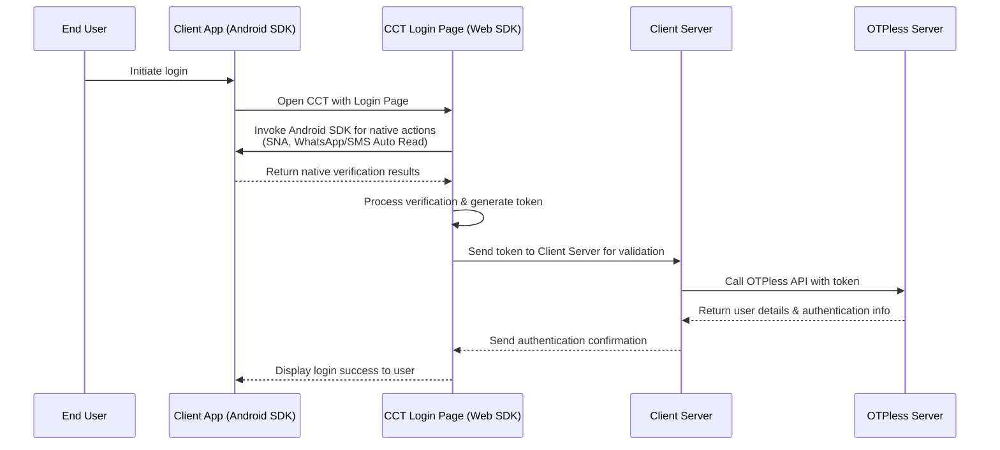
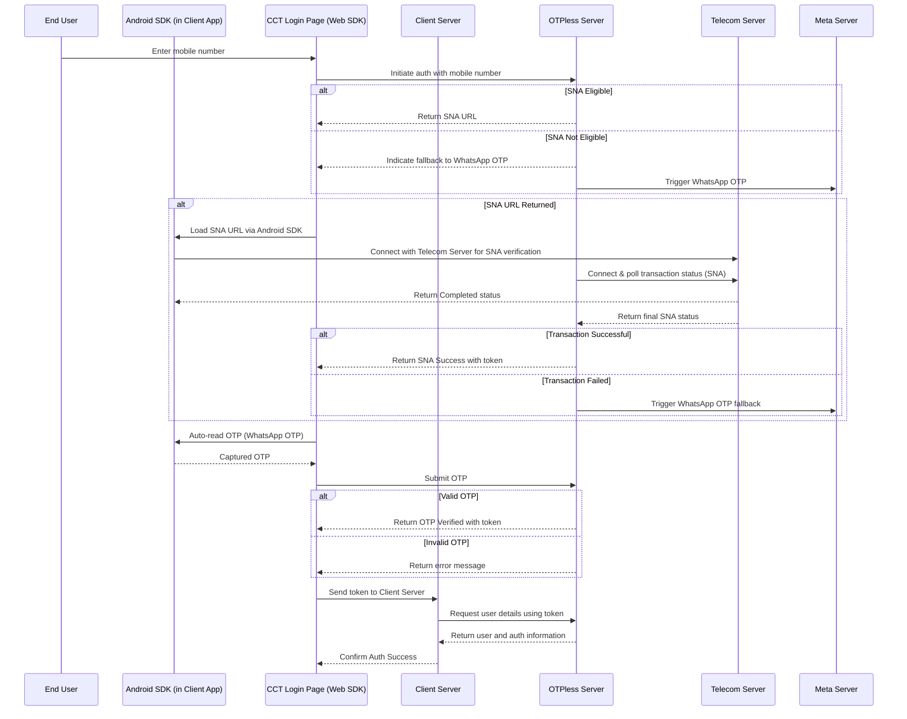

> ## Documentation Index
>
> Fetch the complete documentation index at: https://otpless.com/docs/llms.txt
> Use this file to discover all available pages before exploring further.

# OTPless Integration in Android App with CCT Login – Developer Guide

> This guide explains how to integrate OTPless into an Android App where the login occurs on a Chrome Custom Tab (CCT). It provides detailed instructions and flow diagrams to help you understand the roles of the Android SDK, Web SDK, and OTPless API during the authentication process.

## Overview of Components

- **Android SDK:**\
  This helper SDK is integrated into your Android App and handles native actions such as loading the Silent Network Authentication (SNA) URL and auto-reading OTP messages (via WhatsApp or SMS). It bridges native device capabilities with the Web SDK loaded in the CCT.
  [OTPless Android SDK Documentation](https://otpless.com/docs/frontend-sdks/app-sdks/android/new/connect/connect-android-js).
- **Web SDK:**\
  The Web SDK is embedded within the login page displayed in the CCT. It orchestrates the authentication process, calls native actions via the Android SDK, and processes the verification results to generate an authentication token.
  [OTPless Headless WEB SDK Documentation](https://otpless.com/docs/frontend-sdks/web-sdks/headless-v5).
- **OTPless API:**\
  The server-side API verifies tokens and retrieves user details. It serves as the final authority for authentication outcomes.
  [OTPless API Documentation](https://otpless.com/docs/api-reference/endpoint/verifytoken/verify-token-with-secure-data)

---

This guide is divided into two main sections:

1. **How to stitch the above components** – A high-level overview of the complete data flow between the components.
2. **Detailed SNA & OTP Flow with Fallback** – An in-depth look at the smart authentication flow with SNA, WhatsApp auto-read OTP, and SMS auto-read.

---

## 1. Basic Authentication Flow (Android App with CCT Login)

This flow illustrates the end-to-end authentication process when integrating OTPless into an Android App using a CCT for the login page.

### Explanation

- **User Initiation:**\
  The end user starts the login process in the Android App.
- **CCT Login Page Display:**\
  The Android App opens a Chrome Custom Tab (CCT) to display the Login Page that embeds the Web SDK. The Web SDK handles the authentication orchestration.
- **Native Actions via Android SDK:**\
  The Web SDK calls the Android SDK to perform native actions such as SNA and auto-read OTP (WhatsApp/SMS). The results are sent back to the Web SDK.
- **Token Generation & Validation:**\
  The Web SDK processes the verification results, generates an authentication token, and forwards it to the Client Server. The Client Server validates the token with the OTPless API and retrieves user details.
- **Final Authentication Confirmation:**\
  The Client Server sends back authentication confirmation, which is communicated to the Android App through the CCT, completing the login process.

---

## 2. Detailed SNA & OTP Flow with Fallback

This section details the extended flow, including the SNA process with a fallback to WhatsApp OTP when necessary.

### Explanation

- **Mobile Number Input & Auth Initiation:**\
  The process begins when the user enters their mobile number on the CCT Login Page (Web SDK). The mobile number is sent to the OTPless Server to initiate authentication.
- **SNA Eligibility & Fallback Mechanism:**
  - **If SNA is Eligible:** The OTPless Server returns a SNA URL to the CCT Login Page.
  - **If Not Eligible:** The OTPless Server indicates a fallback to WhatsApp OTP and triggers it via the Meta Server.
- **SNA Flow:**
  - Upon receiving the SNA URL, the CCT instructs the Android SDK to load it.
  - **Simultaneous Telecom Server Polling:**\
    Both the Android SDK and the OTPless Server connect to the Telecom Server to poll the SNA transaction status.
  - The Telecom Server returns a status to both:
    - **If Successful:** The OTPless Server sends a SNA Success response with a token to the CCT.
    - **If Failed:** The OTPless Server triggers the fallback to WhatsApp OTP.
- **WhatsApp OTP Flow:**\
  The Android SDK auto-reads the WhatsApp OTP, which is then submitted by the CCT to the OTPless Server. The OTPless Server verifies the OTP and returns a token if valid or an error if invalid.
- **Final User Details Retrieval:**\
  With a valid token, the CCT sends it to the Client Server, which then uses the token to request user details from the OTPless API. The Client Server confirms the authentication success back to the CCT.

---

# Conclusion

This guide provides a detailed and developer-friendly overview of integrating OTPless into an Android App using a Chrome Custom Tab (CCT) for login. By understanding the roles of the Android SDK, Web SDK, and OTPless API, and following the outlined flows, developers can implement a secure, efficient, and seamless authentication process.
If you have any questions or need further assistance, please feel free to reach out.
