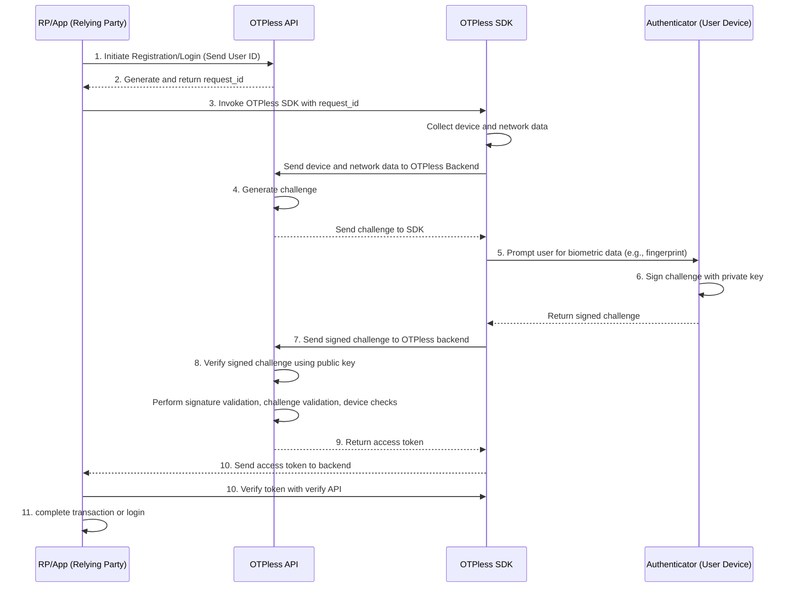

> ## Documentation Index
>
> Fetch the complete documentation index at: https://otpless.com/docs/llms.txt
> Use this file to discover all available pages before exploring further.

# Integration Overview

> This document provides a comprehensive overview of how **OTPless Passkey** integrates with your app/website to offer secure, passwordless biometric authentication for end users. The integration is based on the **FIDO 2.0** framework, leveraging the security and convenience of **passkeys**. The focus is on the technical flow within the **OTPless SDK**, key entities like the **Relying Party (RP)**, **Authenticator**, and **Client**, and how passkeys enable strong authentication. Additionally, it details the backend checks OTPless performs to verify the authenticator's response during both registration and login.

## 2. **Key Terms and Components**

### 2.1 **Passkey**

A **Passkey** is a passwordless authentication mechanism built on **FIDO 2.0** that uses asymmetric cryptography public-private key pairs for authentication. The **passkey** is stored securely on the user’s device (Authenticator) and never leaves the device. It is used to sign authentication challenges, providing a highly secure and convenient login or transaction approval experience.

### 2.2 **Relying Party (RP)**

In this context, **you/client** is the **Relying Party (RP)**, the entity that wants to verify the user's identity for a particular action (login or transaction approval). The RP is responsible for triggering the authentication flow and verifying the response returned by the user’s device (via OTPless).

### 2.3 **Authenticator**

The **Authenticator** is a device (platform or roaming) that stores the user’s **private key** and performs biometric authentication. It can be a mobile device’s fingerprint scanner, face ID, or an external hardware key. The **Authenticator** never exposes the **private key** and uses it to sign challenges generated by the RP.

### 2.4 **Client (User Agent)**

The **Client** refers to the user’s device (e.g., mobile app or browser) where the **OTPless SDK** is integrated. It facilitates communication between the **Authenticator** and the **Relying Party**, ensuring the biometric verification process is secure and seamless.

### 2.5 **FIDO 2.0 Framework**

The **FIDO 2.0** framework underpins the passkey-based authentication system, offering strong, passwordless authentication using public-key cryptography. FIDO 2.0 guarantees that sensitive information like biometric data or private keys never leave the device.

### 2.6 **Factor of Authentication**

OTPless’s **Passkey** authentication combines multiple factors of authentication to ensure a highly secure process:

- **What the user has**: The **device** (Authenticator) with the private key stored locally.
- **Who the user is**: The **biometric** identity of the user (fingerprint, facial recognition) verified locally on device level.

---

## 3. **Product Overview**

### 3.1 **Passkey-Based Authentication**

OTPless enables secure, passwordless login and transaction authentication using **passkeys**. Your App integrates OTPless to ensure seamless and secure identity verification without relying on passwords/OTPs.

#### Key Benefits:

- **Passwordless Authentication**: Removes the need for passwords by using **passkeys** stored on the user’s device for authentication.
- **Strong Security**: **FIDO 2.0** ensures that the private key remains on the user’s device, while the OTPless server only stores the public key.
- **Multi-Device Support**: Works with all types of devices including mobile phones (Android, iOS), tablets, laptops, etc.
- **Seamless User Experience**: Users can authenticate easily using biometrics like fingerprint or face ID.

### 3.2 **Use Cases**

- **Transaction Authentication**: Users can approve payment transactions using their **passkeys**, ensuring that only the authenticated user can authorize the transaction.
- **Login Authentication**: Users can log into the Bank's platform securely without passwords by using their passkey.

---

## 4. **Technical Overview and Workflow**

### 4.1 **Registration Flow Using Passkey**

The registration flow outlines how a user enrolls their biometrics on your platform via the **OTPless SDK** to generate a passkey. The main difference between registration and login is that during registration, the user’s **public key** is transmitted to OTPless for future authentication.

#### Steps:

1. **Initiate Registration (Client/RP → OTPless API)**
   - Client/RP (as the Relying Party) sends a request to the OTPless **initiate API**, passing the **User ID** using a server-to-server call.
   - OTPless generates a **request\_id** and returns it to the Client server.

2. **Invoke OTPless SDK with Request ID**
   - Clients frontend (browser/mobile app) invokes the **OTPless SDK** with the **request\_id**.

3. **OTPless SDK Collects Device and Network Data**
   - The **OTPless SDK** gathers device information (e.g., OS version, device type) and network information to ensure the authenticity of the device and for device management.

4. **Generate Challenge for Registration**
   - OTPless generates a **challenge** (random unique string) that will be signed by the authenticator during the registration process. This challenge ensures that the registration process is secure and originates from a trusted source.

5. **Generate Passkey (Public-Private Key Pair)**
   - The **Authenticator** on the user’s device generates a **public-private key pair**.
   - The **public key** is sent to OTPless, while the **private key** remains securely stored in the authenticator (e.g., the user’s mobile device or security key).

6. **Biometric Authentication and Challenge Signing**
   - The **Authenticator** uses the **private key** to sign the **challenge**.

7. **Passkey Registration**
   - OTPless stores the **public key** in its backend for future authentication. This is the passkey’s public component, associated with the user.

8. **Backend Validation**:
   - OTPless validates the incoming **public key** and ensures that it matches the user’s device information and challenge.
   - The challenge is verified using the signed response from the authenticator.

9. **RP Verifies Token**
   - RP's backend verifies the **access token** by a server-to-server call to OTPless and proceeds with the transaction or login based on successful authentication.

---

### 4.2 **Login/Authentication Flow Using Passkey (FIDO 2.0)**

In the login/authentication flow, the process is almost identical to registration, with the exception that the **public key** is not transmitted again. Instead, the stored public key is used to verify the signed challenge from the user's authenticator.

#### Steps:

1. **Initiate Authentication (RP → OTPless API)**
   - **RP** initiates the authentication process by calling the **OTPless initiate API**, passing the **User ID**.
   - OTPless generates a **request\_id** and sends it back to Client.

2. **Invoke OTPless SDK with Request ID**
   - RP's frontend invokes the **OTPless SDK** using the **request\_id**.
   - The SDK triggers the biometric authentication process.

3. **Generate Challenge**
   - The **OTPless Backend** generates a **challenge** (a random string) and sends it to the **SDK** on the client’s device.

4. **Biometric Authentication and Challenge Signing**
   - The **Authenticator** verifies the user’s biometrics (e.g., fingerprint, face ID).
   - Upon successful verification, the **Authenticator** uses the **private key** to sign the **challenge**.

5. **Return Signed Challenge**
   - The signed challenge is returned to the OTPless backend via the SDK.

6. **Backend Verification**
   - OTPless verifies the signed challenge using the **public key** stored during registration. The checks include:
     - **Signature Verification**: Ensures the signature is valid and was made using the correct private key.
     - **Challenge Validation**: Verifies that the returned signed challenge matches the one issued during the authentication process.
     - **Device Check**: Ensures the request is coming from the same device associated with the public key.
   - If all checks pass, OTPless generates an **access token**.

7. **RP Verifies Token**
   - RP's backend verifies the **access token** by a server-to-server call to OTPless and proceeds with the transaction or login based on successful authentication.

---

## 5. **Internal Operations of OTPless SDK**

The **OTPless SDK** is responsible for managing the technical operations required to securely perform biometric authentication via passkeys.

### 5.1 **Request Handling and Initialization**

- **Input**: RP passes the **request\_id** to the SDK.
- **Action**: The SDK initiates the passkey authentication flow, either performing a new biometric registration or authenticating the user

.

### 5.2 **Device and Network Profiling**

- The SDK collects information about the **device** (e.g., OS type, version, model) and the **network** (e.g., IP, geolocation) to ensure context-aware authentication and security.

### 5.3 **Biometric Prompt**

- The SDK prompts the user to either register their biometric for passkey creation or verify their biometric for passkey-based authentication.

### 5.4 **Challenge Signing with Passkey**

- For **authentication**, the **Authenticator** signs the challenge using the **private key** stored during registration.
- For **registration**, the **Authenticator** generates a **public-private key pair** (passkey) that will be used for future logins.

### 5.5 **Token Management**

- The SDK encrypts the signed challenge and sends it to the **OTPless Backend**.
- Upon verification, the OTPless backend generates a **token** and sends it back to RP on the client side.

---

## 6. **Security and Compliance**

### 6.1 **FIDO 2.0 Framework**

The **FIDO 2.0** framework provides the foundation for the secure and passwordless authentication system used by **OTPless Passkey**. Key security features include:

- **Public-Key Cryptography**: The passkey system uses asymmetric encryption, where the **private key** remains securely stored on the user’s device, and the **public key** is used to verify the signed challenges.

- **Device-Based Security**: Biometric data and the **private key** are never exposed or transmitted, making it resistant to phishing and man-in-the-middle attacks.

### 6.2 **Data Privacy**

- **GDPR Compliance**: User data, including biometrics, are never exposed to third parties. Only encrypted tokens and public keys are transmitted.
- **PSD2 Compliance**: Passkey-based authentication complies with strong customer authentication (SCA) requirements, making it ideal for financial transactions.

---

## 7. **Conclusion**

**OTPless Passkey** integrates seamlessly with RP platform to provide a **passwordless**, highly secure biometric authentication system based on the **FIDO 2.0** framework. The use of **passkeys** ensures that sensitive information is never compromised, offering a future-proof solution for both login and transaction authentication.
