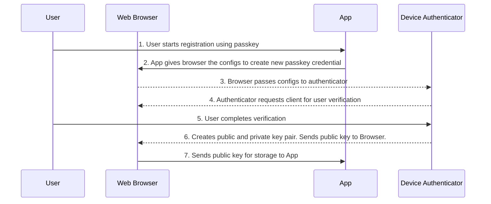
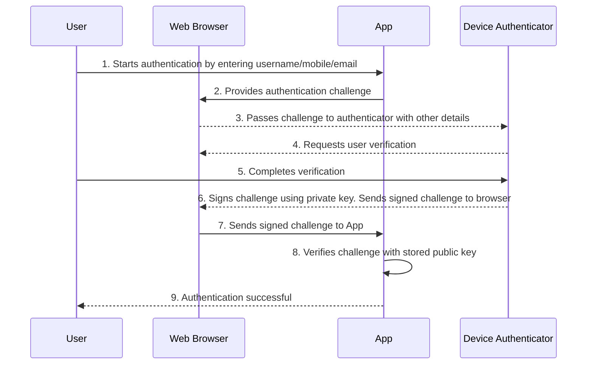

> ## Documentation Index
>
> Fetch the complete documentation index at: https://otpless.com/docs/llms.txt
> Use this file to discover all available pages before exploring further.

# Understanding Passkeys and How They Work

> An in-depth look at passkeys, their operation, benefits, and implementation with OTPless.

### What Are Passkeys and How Do They Work?

For decades, passwords have been the cornerstone of online authentication. However, they are increasingly becoming a liability. Passwords create friction for users, provide vulnerabilities for attackers, and burden IT teams with constant reset requests. Enter **passkeys**—a more secure and user-friendly solution for logging into websites and applications.

This article will explore the fundamentals of passkeys, how they operate, and the benefits and challenges of adopting them. We'll also highlight how OTPless simplifies integrating passkey authentication.

### What Are Passkeys?

Passkeys are a digital credential that replaces traditional passwords, offering a seamless and secure way to authenticate users. Instead of remembering and typing passwords, users can log in with a fingerprint, face scan, or PIN—the same way they unlock their devices.

Passkeys leverage public-private key cryptography to authenticate users without storing sensitive information on servers, making them highly secure against phishing and other attacks.

### Key Industry Supporters of Passkeys

Leading tech companies have embraced passkeys:

- **Apple:** Passkey support integrated into iOS and macOS with iCloud Keychain synchronization.
- **Google:** Passkeys available across Android and Chrome with Google Password Manager.
- **Microsoft:** Passkeys integrated with Windows Hello and Azure AD.
- **PayPal:** Streamlining payments with enhanced security.
- **Shopify:** Reducing checkout friction in e-commerce.

### How Do Passkeys Work?

Passkeys rely on **public key cryptography**, ensuring that sensitive information like private keys remains secure on the user’s device. They follow the **WebAuthn** standard, which is part of the FIDO2 specification.

### Registration Process

The first step in using passkeys is the registration ceremony, where the public-private key pair is generated. Here’s how it works:

1. **User Initiation**: The user initiates the registration process by selecting passkeys as their preferred authentication method on the application.
2. **App Configuration**: The application provides the web browser (client) with the necessary configuration details, such as the Relying Party (RP) information and user details, to create a passkey credential.
3. **Passing Configurations to Authenticator**: The web browser forwards these configurations to the device authenticator (e.g., Face ID, Touch ID, or a FIDO2 security key).
4. **Authenticator Verification**: The authenticator requests the browser for user verification to ensure the user’s presence and identity.
5. **User Verification**: The user completes the verification process using biometrics (like fingerprint or facial recognition) or another verification method supported by the authenticator.
6. **Key Pair Creation**: The authenticator generates a public-private key pair. The private key is securely stored on the device, while the public key is sent back to the browser.
7. **Credential Storage**: The web browser sends the public key to the application, which securely stores it to complete the registration process.

### Authentication Process

When a user attempts to log in with passkeys, the following steps occur:

1. **User Initiation:** The user begins the authentication ceremony by selecting passkeys as the login method.
2. **Challenge Issuance:** The application sends an authentication challenge to the web browser.
3. **Challenge Forwarding:** The browser forwards the challenge to the authenticator (e.g., Face ID, Touch ID, or FIDO2 security key).
4. **Authenticator Verification:** The authenticator requests user verification (e.g., biometrics, PIN).
5. **User Verification:** The user completes verification using the method chosen during registration.
6. **Challenge Signing:** The authenticator signs the challenge using the private key stored during registration and returns the signed challenge to the browser.
7. **Challenge Submission:** The browser sends the signed challenge to the application.
8. **Challenge Validation:** The application validates the signed challenge using the public key.
9. **Authentication Success:** If the challenge is valid, the user is successfully logged in.

### Benefits of Passkeys

#### Enhanced Security

- **Phishing Resistance:** Passkeys are domain-bound, preventing use on fake websites.
- **Data Breach Protection:** Only public keys are stored on servers, making breaches far less impactful.

#### Better User Experience

- **Familiar Interactions:** Users authenticate the same way they unlock their devices.
- **Faster Logins:** Authentication is quicker than typing passwords or entering OTPs.

#### Simplified Multi-Factor Authentication (MFA)

- **Built-In MFA:** Device possession and biometrics combine seamlessly for strong security.

#### Privacy-Centric

- **Local Data Storage:** Biometric data and private keys never leave the user’s device.

#### Challenges of Passkeys

#### Compatibility

While major platforms support passkeys, some legacy systems and devices may lag in adoption.

#### Implementation Complexity

Integrating passkeys involves understanding WebAuthn, setting up FIDO2-compliant servers, and managing fallback options.

<Note>
  OTPless SDK simplifies the implementation complexity with simple few lines of code.
</Note>

## Implementing Passkeys with OTPless

OTPless simplifies passkey adoption with an easy-to-use API. Here’s how OTPless helps:

1. **Quick Setup:** Integrate passkeys with just a few lines of code.
2. **Multi-Channel Support:** Combine passkeys with other authentication channels like Silent Network Authentication (SNA) and WhatsApp.
3. **Federated Identity Provider:** Use OTPless as an IdP to integrate passkeys with existing login flows.
4. **Cross-Platform Compatibility:** Enable seamless cross-device authentication and fallback support.

### Conclusion

Passkeys represent a significant leap forward in authentication technology. They combine unmatched security with a user-friendly experience, making them ideal for modern apps. With OTPless, developers can quickly adopt this powerful authentication method, ensuring both security and convenience for their users.

Ready to make the switch? [Get started with OTPless](otpless.com/login) today!
