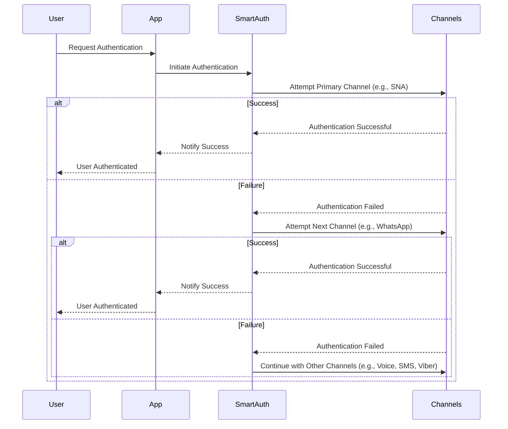

> ## Documentation Index
>
> Fetch the complete documentation index at: https://otpless.com/docs/llms.txt
> Use this file to discover all available pages before exploring further.

# SmartAuth: Revolutionizing Phone Number Verification

> SmartAuth is an advanced authentication orchestration tool for phone number verification, designed to maximize conversion rates and minimize delivery times. By leveraging multiple channels and adaptive mechanisms, SmartAuth ensures fast, secure, and seamless user verification globally.

<Frame type="glass">
  
</Frame>

## Key Features

<CardGroup cols={3}>
  <Card title="Multi-Channel Authentication" icon="network-wired">
    Supports various channels like Network Auth (SNA), WhatsApp, Voice, SMS, and Viber.
  </Card>

  <Card title="Intelligent Failover" icon="arrows-retweet">
    Automatically resends authentication messages across multiple channels in sequence through a single request, without additional code.
  </Card>

  <Card title="Adaptive Routing" icon="route">
    Ensure optimal message delivery by dynamically re-routing through multiple providers specific to the user’s country.
  </Card>

  <Card title="Global Reach" icon="globe">
    Scales your authentication globally, ensuring high delivery rates and seamless user verification across different regions.
  </Card>

  <Card title="Flexible Configuration" icon="gear">
    Clients can configure preferred authentication channels and set their priority order, enabling a tailored user experience.
  </Card>

  <Card title="Attack & Fraud Prevention" icon="shield">
    Protect your revenue and reputation with real-time alerting and automatic blocking of suspicious authentication traffic.
  </Card>

  <Card title="Geo-customization" icon="location-dot">
    Tailor messaging language and sender ID to specific locales for a more personalized user experience.
  </Card>

  <Card title="High Availability" icon="cloud">
    Hosted on our global cloud infrastructure, ensuring a faster, more reliable product experience.
  </Card>

  <Card title="Custom Templates" icon="pen-to-square">
    Customize message templates, pre-record voice calls, and configure retry intervals.
  </Card>
</CardGroup>

## Authentication Channels

<CardGroup cols={3}>
  <Card title="Silent Network Authentication (SNA)" icon="tower-cell">
    Utilizes the mobile network's inherent security features to authenticate users silently without user interaction.
  </Card>

  <Card title="WhatsApp" icon="whatsapp">
    Leverage WhatsApp's extensive user base for simple and secure authentication, boosting success rates by 30%.
  </Card>

  <Card title="SMS" icon="comment">
    Deliver SMS using approved sender IDs that comply with local regulations.
  </Card>

  <Card title="Viber" icon="viber">
    Sends a verification link or OTP via Viber to the user's phone number.
  </Card>

  <Card title="Voice" icon="phone-volume">
    Delivers a voice call with a verification code or text-to-speech approval call to the user's phone.
  </Card>
</CardGroup>

## Authentication Methods

<CardGroup cols={3}>
  <Card title="Magic Link" icon="link">
    Provides a secure and seamless login experience via a magic link sent to the user’s phone.
  </Card>

  <Card title="One-Time Code (OTP)" icon="lock">
    Uses a time-sensitive code sent via SMS, voice, or other channels for secure authentication.
  </Card>

  <Card title="Voice Approval" icon="microphone">
    Provides a secure authentication call, verifying user identity through voice interaction.
  </Card>
</CardGroup>

## Workflow

### Overview of SmartAuth Workflow

### Detailed Workflow Steps

1. **Initialization**: The client application requests authentication for a user by providing their phone number and relevant details.
2. **Primary Channel Attempt**: SmartAuth first attempts to authenticate the user using the primary (highest priority) channel.
3. **Fallback Mechanism**: If the primary channel fails, SmartAuth automatically falls back to the next configured channel in the sequence.
4. **Completion**: The process completes successfully once any channel verifies the user. If all configured channels fail, the system logs the failure and triggers an appropriate response.

## How to integrate Smart Auth with OTPLESS SDK?

<Steps>
  <Step title="Sign in on the OTPless Dashboard">
    Use your work email ID to sign in.
  </Step>

  <Step title="Navigate to Channel Configuration">
    Access the Channel Configuration settings from the dashboard.
  </Step>

  <Step title="Select the Phone Settings">
    Go to the phone settings section.
  </Step>

  <Step title="Enable Smart Auth">
    Toggle the Smart Auth option to enable it.
  </Step>

  <Step title="Choose Auth Methods and Set Priorities">
    Select your preferred authentication methods and set the priority order for the channels you've chosen.
  </Step>

  <Step title="Save and Publish">
    Ensure to save your configuration and publish the changes.
  </Step>

  <Step title="Integrate the Pre-built UI or Headless SDK">
    Incorporate the pre-built UI or headless SDK into your app or website login page.
  </Step>
</Steps>

## Conclusion

SmartAuth provides a robust and flexible solution for phone number authentication, significantly enhancing user experience and conversion rates by leveraging multiple channels and a waterfall mechanism. Its comprehensive logging, fraud detection, and easy integration make it an ideal choice for secure and efficient user verification. By adopting SmartAuth, businesses can ensure higher authentication success rates, improved user satisfaction, and stronger security measures.

For more information, visit our [documentation](/frontend-sdks/web-sdks/javascript) or contact our [support team](https://otpless.com/support).
