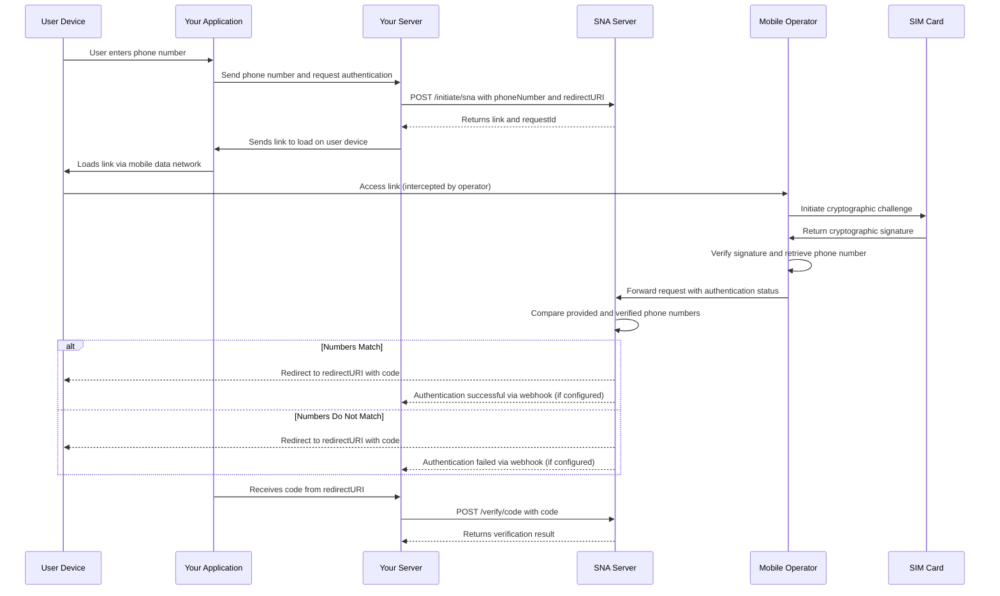

> ## Documentation Index
>
> Fetch the complete documentation index at: https://otpless.com/docs/llms.txt
> Use this file to discover all available pages before exploring further.

# Silent Network Authentication API

> This documentation serves as a comprehensive guide to integrating and utilizing the SNA API in your web and mobile applications.

## Introduction

**Silent Network Authentication (SNA)** is an innovative authentication technology that leverages the cryptographic capabilities of mobile **Subscriber Identity Module (SIM)** cards to authenticate users seamlessly. Unlike traditional methods such as SMS-based **One-Time Passwords (OTPs)**, SNA operates silently in the background without requiring any user interaction, providing a frictionless and secure user experience.

## Prerequisites

- **API Credentials**: Obtain your `clientId` and `clientSecret` by registering on the [OTPless Dashboard](https://otpless.com).
- **Programming Knowledge**: Familiarity with HTTP/HTTPS protocols and JSON data format.
- **Environment**: Tools to make API requests (e.g., cURL, Postman, or any programming language with HTTP libraries).
- **SNA Activation**: Contact your Relationship Manager or email [support@otpless.com](mailto:support@otpless.com) to activate the SNA feature for your application.

## Base URL

All API requests are made to the following base URL:

```
https://auth.otpless.app/auth/v1/
```

## Authentication

Authentication is required for all endpoints. Use your `clientId` and `clientSecret` in the request headers to authenticate API calls.

### Headers

<ParamField header="clientId" type="string" required>
  Your unique client identifier.
</ParamField>

<ParamField header="clientSecret" type="string" required>
  Your client secret key.
</ParamField>

<ParamField header="Content-Type" type="string" required initialValue="application/json">
  Should be set to `application/json`.
</ParamField>

## Endpoints

### 1. Initiate SNA Authentication

- **Endpoint**: `POST /initiate/sna`
- **Description**: Initiates the Silent Network Authentication process for a given phone number.
- **Full URL**: `https://auth.otpless.app/auth/v1/initiate/sna`

#### Request Body Parameters

<ParamField body="phoneNumber" type="string" required>
  The user's phone number with country code (e.g., "917020141726" for a number in India).
</ParamField>

<ParamField body="redirectURI" type="string" optional>
  The URL to redirect the user after authentication.
</ParamField>

<ParamField body="mcc" type="string" optional>
  Mobile Country Code (MCC) of the user's mobile network for extra filtering.
  **Note**: If you choose to provide `mcc` and `mnc` for additional filtering, both must be provided.
</ParamField>

<ParamField body="mnc" type="string" optional>
  Mobile Network Code (MNC) of the user's mobile network for extra filtering.
</ParamField>

<ParamField body="remoteAddress" type="string" optional>
  User's data network IP address for additional filtering.
</ParamField>

#### Response Parameters

<ResponseField name="requestId" type="string">
  A unique identifier for the authentication request.
</ResponseField>

<ResponseField name="link" type="string">
  A URL to direct the user to complete the authentication process.
</ResponseField>

#### Sample cURL Request

```bash theme={null}
curl --location 'https://auth.otpless.app/auth/v1/initiate/sna' \
--header 'clientId: YOUR_CLIENT_ID' \
--header 'clientSecret: YOUR_CLIENT_SECRET' \
--header 'Content-Type: application/json' \
--data '{
    "phoneNumber": "YOUR_PHONE_NUMBER",
    "redirectURI": "YOUR_REDIRECT_URI",
    "mcc": "YOUR_MCC",
    "mnc": "YOUR_MNC",
    "remoteAddress": "YOUR_REMOTE_ADDRESS"
}'
```

#### Example

<CodeGroup>
  ```bash Request theme={null}
  curl --location 'https://auth.otpless.app/auth/v1/initiate/sna?requestId=auth_request_id' \
  --header 'clientId: YOUR_CLIENT_ID' \
  --header 'clientSecret: YOUR_CLIENT_SECRET' \
  --header 'Content-Type: application/json' \
  --data '{
      "phoneNumber": "917020141726",
      "redirectURI": "https://example.com",
      "mcc": "404",
      "mnc": "01"
  }'
  ```

```json Response Success theme={null}
{
  "requestId": "dfa704d7251c477fab7a3c6596850d1f",
  "link": "https://otpless.me/fVULFGCN1Prz0UP"
}
```

```json Response Error theme={null}
{
  "message": "Invalid Request",
  "errorCode": "7102",
  "description": "Invalid phone number."
}
```

</CodeGroup>

---

### 2. Verify Code API

- **Endpoint**: `POST /verify/code`
- **Description**: Verifies the code received by the client after authentication to confirm the user's identity.
- **Full URL**: `https://auth.otpless.app/auth/v1/verify/code`

#### When and Why to Use the Verify Code API

After initiating the authentication process, the user's device accesses the `link` provided in the response. Upon successful authentication, the user is redirected to the specified `redirectURI` along with a `code` as a query parameter (e.g., `https://example.com/?code=RECEIVED_CODE`).

The `code` is a short-lived token that needs to be verified to confirm the user's identity and complete the authentication process securely. The Verify Code API is used to validate this `code` on your server side.

**Note**: The `code` expires after a short period (typically 5 minutes) and can be used only once.

#### Request Body Parameters

<ParamField body="code" type="string" required>
  The code received by the client after authentication.
</ParamField>

#### Response Parameters

<ResponseField name="requestId" type="string">
  Unique request identifier.
</ResponseField>

<ResponseField name="message" type="string">
  Status message indicating the result.
</ResponseField>

<ResponseField name="userDetails" type="object">
  Detailed information about the user and the authentication session.
</ResponseField>

#### Sample cURL Request

```bash theme={null}
curl --request POST \
  --url https://auth.otpless.app/auth/v1/verify/code \
  --header 'Content-Type: application/json' \
  --header 'clientId: YOUR_CLIENT_ID' \
  --header 'clientSecret: YOUR_CLIENT_SECRET' \
  --data '{
  "code": "RECEIVED_CODE"
}'
```

#### Example

<CodeGroup>
  ```bash Request theme={null}
  curl --request POST \
    --url https://auth.otpless.app/auth/v1/verify/code \
    --header 'Content-Type: application/json' \
    --header 'clientId: YOUR_CLIENT_ID' \
    --header 'clientSecret: YOUR_CLIENT_SECRET' \
    --data '{
    "code": "saih1234"
  }'
  ```

```json Response Success theme={null}
{
  "requestId": "84798596cfcd4dee9e924ba1f7f68604",
  "message": "Code verified successfully",
  "userDetails": {
    "token": "84798596cfcd4dee9e924ba1f7f68604",
    "status": "SUCCESS",
    "completedAt": 1727185666720,
    "identities": [
      {
        "identityType": "MOBILE",
        "identityValue": "917020141726",
        "channel": "SILENT_AUTH",
        "methods": ["SILENT_AUTH"],
        "verified": true,
        "verifiedTimestamp": 1727185666720
      }
    ],
    "network": {
      "ip": "152.58.34.13"
    },
    "deviceInfo": {
      "userAgent": "Mozilla/5.0 (iPhone; CPU iPhone OS 18_1 like Mac OS X)",
      "platform": "iPhone",
      "vendor": "Apple Computer, Inc.",
      "language": "en-IN",
      "cookieEnabled": true,
      "screenWidth": 430,
      "screenHeight": 932,
      "screenColorDepth": 24,
      "devicePixelRatio": 3.0
    }
  }
}
```

```json Response Error theme={null}
{
  "message": "Invalid Request",
  "errorCode": "7002",
  "description": "Authorization error: Invalid credentials."
}
```

</CodeGroup>

---

## How SNA Works

### Overview

Silent Network Authentication (SNA) utilizes the cryptographic capabilities of the user's SIM card to authenticate them without any user interaction. By leveraging direct connections with mobile network operators, SNA provides a highly secure and frictionless authentication experience.

### Technical Flow

Below is a step-by-step explanation of how SNA works:

1. **User Initiates Authentication**: The user provides their phone number in your application.

2. **Server-to-Server Communication**: Your server sends a request to the SNA API endpoint `/initiate/sna` with the user's phone number and optionally a `redirectURI`.

3. **Link Generation**: The SNA API generates a unique, time-bound `link` and returns it to your server.

4. **Link Loaded on Device**: Your application loads the `link` on the user's device using the device's mobile data network (not Wi-Fi).

5. **SIM-Based Cryptographic Challenge**:
   - When the `link` is accessed, the mobile network operator intercepts the request and initiates a cryptographic challenge directly with the SIM card.
   - The SIM card generates a cryptographic signature using its embedded private key and sends it back to the mobile operator.
   - The mobile operator verifies the signature using the corresponding public key and retrieves the SIM's **International Mobile Subscriber Identity (IMSI)**.

6. **Phone Number Retrieval**:
   - The mobile operator associates the IMSI with the user's phone number (**Mobile Station International Subscriber Directory Number (MSISDN)**).
   - The operator matches the verified phone number with the one the user has provided.

7. **Server-Side Verification**:
   - The SNA server (OTPless) receives the authentication status from the mobile operator.
   - If the numbers match, the authentication is successful; else, it fails.

8. **Response to Your Application**:
   - The SNA server sends a response to your server indicating the authentication result via webhook (if configured).
   - Also, your client-side will receive the `code` as a query parameter in the `redirectURI`, which you can pass to the Verify Code API to get the final result.

9. **User Redirection**:
   - Upon successful authentication, the user is redirected to the specified `redirectURI` (optional) with the `code`.

### Technical Flow Diagram



---

## Features

- **Frictionless User Experience**: Authenticates users without requiring any action on their part after initiating authentication.
- **Enhanced Security**: Utilizes SIM-based cryptography and direct operator integrations to mitigate common security threats.
- **High Conversion Rates**: Reduces user drop-off during authentication processes, leading to better engagement and retention.

---

## Security Measures

SNA incorporates multiple layers of security to ensure authentication integrity:

- **SIM-Based Cryptography**: Utilizes the secure cryptographic capabilities of the SIM card, which are tamper-resistant and unique to each SIM.
- **Server-Initiated Flow**: All sensitive data exchanges occur between servers, reducing exposure to client-side vulnerabilities.
- **Source IP Verification**: The SNA server records the source IP of requests to ensure they come from legitimate mobile networks.
- **Device Signature Matching**: Compares device signatures to detect potential phishing or man-in-the-middle attacks.
- **Latency Monitoring**: Monitors the time taken for each authentication step to detect anomalies that may indicate fraudulent activities.

---

## Error Codes

The API uses standard HTTP status codes along with custom error codes for more granular error handling.

### HTTP Status Codes

- **200 OK**: Successful request.
- **400 Bad Request**: Missing or invalid parameters.
- **401 Unauthorized**: Authentication failed due to invalid credentials.
- **403 Forbidden**: Access to the resource is denied.
- **404 Not Found**: The requested resource does not exist.
- **429 Too Many Requests**: Rate limit exceeded.
- **500 Internal Server Error**: An error occurred on the server.

### Custom Error Codes

| Error Code | HTTP Status | Message                    | Description                                          |
| ---------- | ----------- | -------------------------- | ---------------------------------------------------- |
| **7102**   | 400         | INVALID\_REQUEST           | Invalid phone number.                                |
| **7108**   | 400         | INVALID\_REQUEST           | Invalid redirect URI.                                |
| **7012**   | 401         | ACCESS\_BLOCKED            | Authorization error: Merchant credentials are empty. |
| **7002**   | 401         | ACCESS\_BLOCKED            | Authorization error: Invalid credentials.            |
| **7026**   | 403         | ACCESS\_DENIED             | Your account does not have access to this resource.  |
| **7125**   | 400         | NETWORK\_UNSUPPORTED       | The phone number's network is not supported.         |
| **7126**   | 400         | MCC\_MNC\_UNSUPPORTED      | The provided MCC and MNC are not supported.          |
| **7127**   | 400         | MCC\_MNC\_MISMATCH         | Provided MCC & MNC do not match with phone network.  |
| **7128**   | 200         | USER\_VERIFICATION\_FAILED | Providers failed to verify.                          |
| **7129**   | 200         | USER\_VERIFICATION\_FAILED | Providers failed to verify due to IP mismatch.       |
| **7130**   | 200         | USER\_VERIFICATION\_FAILED | User verification failed for other reasons.          |

**Error Response Format**

```json theme={null}
{
  "message": "Invalid Request",
  "errorCode": "7102",
  "description": "Invalid phone number."
}
```

---

## Best Practices

- **Secure Your Credentials**: Keep your `clientId` and `clientSecret` confidential.
- **Handle Fallbacks Gracefully**: Implement UI flows to handle cases where silent authentication is not possible.
- **Monitor Error Codes**: Implement robust error handling based on the provided error codes.
- **Record Additional Parameters**: Utilize additional security parameters provided in the response to enhance security.

---

## FAQs

### How do I obtain my `clientId` and `clientSecret`?

Register on the [OTPless Dashboard](https://otpless.com/login) and navigate to the **Dev Settings** section to generate your `clientId` and `clientSecret`.

### What happens if silent authentication fails?

If silent authentication fails, you should trigger an alternative authentication flow, either with OTPless or from your own system.

### Is SNA compatible with all telecom providers?

SNA is compatible with most major telecom providers. However, availability may vary by region and network. **In India, we currently support Jio and VI.**

### How do I activate SNA for my application?

Contact your Relationship Manager or email us at [support@otpless.com](mailto:support@otpless.com) to activate the SNA feature for your application.

### How does SNA protect against phishing attacks?

SNA employs several measures to mitigate phishing risks:

- **Source IP Verification**: Ensures requests come from legitimate mobile network gateways.
- **Device Signature Matching**: Compares device signatures to detect discrepancies.
- **Latency Monitoring**: Detects anomalies in authentication timing that may indicate phishing attempts.
- **Server-Initiated Flow**: Reduces exposure to client-side manipulation by handling sensitive data exchanges server-to-server.

---

## Glossary of Terms

- **SNA (Silent Network Authentication)**: An authentication method that leverages SIM card cryptography to authenticate users without user interaction.

- **SIM (Subscriber Identity Module)**: A smart card used in mobile devices to store user identity, location, and phone number, as well as network authorization data.

- **OTP (One-Time Password)**: A password that is valid for only one login session or transaction.

- **MCC (Mobile Country Code)**: A three-digit code used to identify the country of a mobile subscriber.

- **MNC (Mobile Network Code)**: A two or three-digit code used to identify the home network of a mobile subscriber.

- **IMSI (International Mobile Subscriber Identity)**: A unique number associated with all cellular networks used to identify a mobile subscriber.

- **MSISDN (Mobile Station International Subscriber Directory Number)**: The phone number associated with a mobile subscriber in a cellular network.
