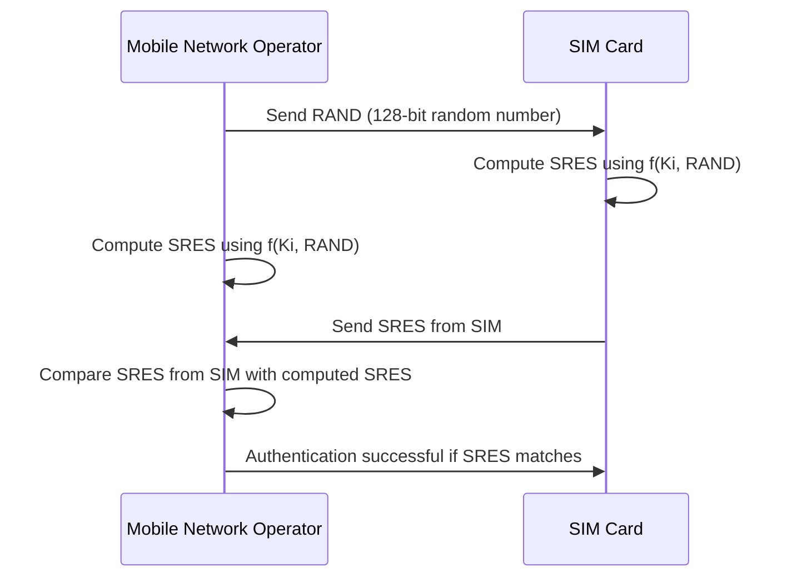

> ## Documentation Index
>
> Fetch the complete documentation index at: https://otpless.com/docs/llms.txt
> Use this file to discover all available pages before exploring further.

# Silent Network Authentication (SNA)

> Silent Network Authentication (SNA) leverages the built-in cryptographic capabilities of a user’s SIM card to verify their identity without any manual input beyond initiating the flow. By directly integrating with mobile network operators, SNA provides an authentication experience that’s both secure and frictionless—delivering a win-win for end users and businesses alike.

## What is SNA?

SNA is an authentication method available at user signup, login, or during a high-risk transaction. It confirms that a user’s SIM (Subscriber Identity Module) is actively connected to the mobile network and not being spoofed or cloned. SNA uses standardized GSM (Global System for Mobile Communications) authentication, a proven technology backed by decades of industry trust.

<Note>
  **Key Requirement:** To initiate SNA, the user’s session must connect via mobile data, not Wi-Fi. This ensures that the underlying GSM authentication process can take place seamlessly. For mobile browsers, users may need to switch off Wi-Fi; mobile apps can enforce a cellular-only data connection programmatically.
</Note>

<Frame type="glass">
  
</Frame>

## How It Works

SNA builds upon GSM’s standard authentication mechanism. Here’s a technical overview:

**Detailed Steps:**

1. **SIM Activation:** The mobile network operator securely assigns a unique key (Ki) to the SIM at activation. Ki never leaves the operator’s systems or the SIM.
2. **Challenge Initialization:** For authentication, the network sends a unique 128-bit random value (RAND) to the SIM.
3. **Signed Response (SRES):** Both the network and the SIM compute a one-way function `f(Ki, RAND)`, resulting in a Signed Response (SRES).
4. **Verification:** The SIM returns its SRES to the network, and the network compares it with its own computed SRES.
5. **Authentication Result:** A matching SRES confirms genuine user presence and SIM integrity.

This symmetric key cryptography makes it extremely challenging for attackers to forge or predict the correct SRES, resulting in a secure and deterministic authentication method.

## Features

1. **Frictionless User Experience**: Users authenticate seamlessly—no PINs, passwords, or additional taps needed. Once triggered, SNA works silently in the background.

2. **Enhanced Security**: By relying on SIM-based cryptography and direct mobile operator connections, SNA drastically reduces common attack vectors like SIM swapping or credential theft.

3. **Higher Conversion Rates**: Streamlined authentication reduces friction, leading to fewer drop-offs and improved user engagement and retention.

## Security Measures

SNA employs multiple layers of protection:

1. **SIM-Based Cryptography:** Tamper-resistant and unique, the SIM’s cryptographic capabilities form the cornerstone of SNA’s trust model.
2. **Server-Initiated Flow:** Sensitive operations occur between secured servers, limiting client-side exposure.
3. **Source IP Verification:** Ensures requests originate from legitimate network sources.
4. **Device Signature Matching:** Compares device signatures to identify phishing or man-in-the-middle attempts.
5. **Latency Monitoring:** Detects anomalies in response times, helping spot suspicious activity.

## Limitations

1. **Cellular Connection Required**: SNA only works over mobile data. If a user is on Wi-Fi, they must switch to cellular data or be prompted to do so—this can be enforced in native mobile apps but may require user action in mobile browsers.

2. **Limited Availability**:SNA is region- and operator-specific. For instance, in India, we currently support Jio and VI networks; Airtel integration is on the roadmap for the next 2-3 months.

Silent Network Authentication stands as a powerful solution for businesses looking to increase security and user satisfaction in one seamless step. While there are constraints—like cellular connectivity and limited operator availability—its benefits of increased trust, reduced user friction, and airtight security make SNA a compelling choice for modern authentication flows.
