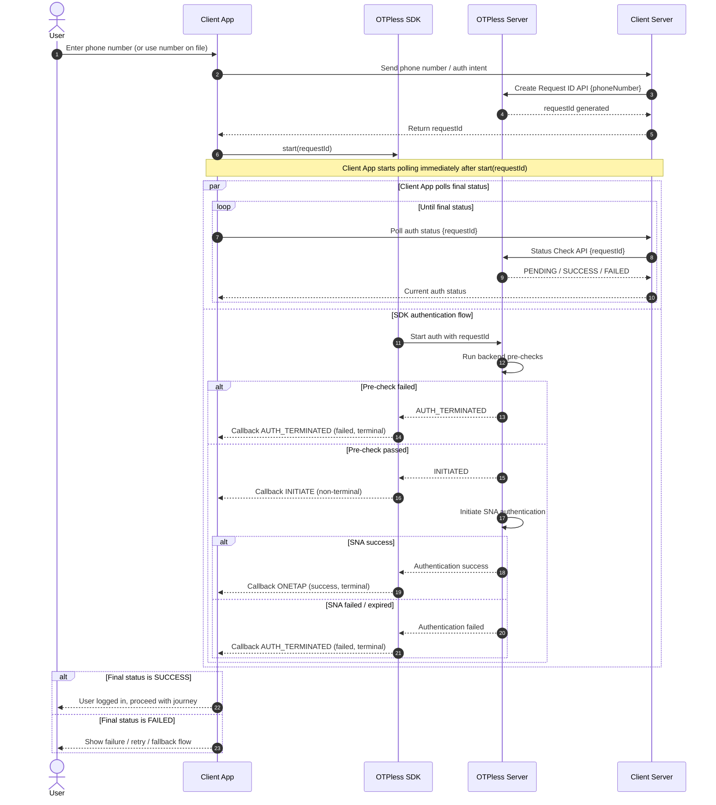

> ## Documentation Index
>
> Fetch the complete documentation index at: https://otpless.com/docs/llms.txt
> Use this file to discover all available pages before exploring further.

# Overview

> End-to-end overview of the SNA-only authentication flow — how the OTPless Create API, SDK, and Status Check API stitch together across platforms.

This guide covers the **Silent Network Authentication (SNA) only** integration using the OTPless SDK. In this configuration SNA is the **single authentication channel** — there is no OTP, WhatsApp, or other fallback. The flow is designed for backend-controlled, server-verified authentication.

## The three building blocks

The integration is built from three pieces that work together regardless of platform (Android or iOS):

| Step                      | Component                                                 | Where it runs                | Purpose                                                                                                                               |
| ------------------------- | --------------------------------------------------------- | ---------------------------- | ------------------------------------------------------------------------------------------------------------------------------------- |
| **1. Create**             | [Create API](/sna/create-api)                             | Your server → OTPless Server | Registers the user's identity (phone number) and returns a `requestId` that links the identity to a future auth flow.                 |
| **2. Initialize & Start** | [Android SDK](/sna/android-sdk) / [iOS SDK](/sna/ios-sdk) | Client app                   | Initializes the SDK, then starts SNA with the `requestId`. The SDK drives the silent network handshake and emits lifecycle callbacks. |
| **3. Status Check**       | [Status Check API](/sna/status-check-api)                 | Your server → OTPless Server | Your backend polls the consolidated auth status for the `requestId` and decides the final outcome.                                    |

<Warning>
  In an SNA-only configuration the **server is the source of truth**. Your backend must rely on the [Status Check API](/sna/status-check-api) result — not the SDK callback alone — to confirm a successful login.
</Warning>

## How the SDK and APIs stitch together

The `requestId` is the thread that ties every step together:

1. Your **server** calls **Create** with the user's phone number and receives a `requestId`.
2. Your **server** hands the `requestId` back to the **client app**.
3. The **client app** passes the `requestId` to the **SDK** via `start()`.
4. The **SDK** performs the silent network handshake with the **Telco Server** and reports progress through callbacks.
5. Independently, your **server** polls **Status Check** with the same `requestId` to determine the final, authoritative result.

## Data flow

The flow is the same on every platform — only the SDK calls differ. The client app starts polling its own backend immediately after calling `start(requestId)`, while the SDK runs the SNA handshake in parallel.

### How to perform the status check

There are two ways to drive the [Status Check API](/sna/status-check-api) poll:

<AccordionGroup>
  <Accordion title="Option 1: Poll right after start()" icon="repeat">
    Begin polling from your backend immediately after calling the SDK `start()` method, and keep polling until you receive a **terminal state** (`SUCCESS` or `FAILED`).

    Always enforce a **timeout threshold** — if no terminal state is reached within that window, stop polling and mark the transaction as **failed (timeout)**. This prevents the poll from running indefinitely if the flow never resolves.

  </Accordion>

  <Accordion title="Option 2: Poll once after the SDK terminal callback (recommended)" icon="flag-checkered">
    Wait for the SDK to emit a terminal callback (`ONETAP` or `AUTH_TERMINATED`), and only then call the Status Check API **once** to fetch the final, authoritative status.

    This makes a single call instead of repeated polling, but it relies on the SDK callback being delivered to the client.

  </Accordion>
</AccordionGroup>

<Note>
  Regardless of the approach, the [Status Check API](/sna/status-check-api) result from your server — not the SDK callback alone — is the source of truth for confirming a successful login.
</Note>

## SDK callback states

The SDK works in two steps, and each step has its own set of callbacks. First, the SDK must be **initialized**. Once initialization succeeds, you invoke the **`start()`** method to begin authentication.

#### Step 1: Initialization callbacks

Emitted when you initialize the SDK.

| Callback    | State        | Meaning                                                                                |
| ----------- | ------------ | -------------------------------------------------------------------------------------- |
| `SDK_READY` | Non-terminal | SDK initialized successfully. You may enable the continue button or proceed with auth. |
| `FAILED`    | Terminal     | SDK failed to initialize. Retry initialization.                                        |

#### Step 2: Start callbacks

Emitted after you invoke `start()` to begin authentication.

| Callback          | State                  | Meaning                                                                                                                  |
| ----------------- | ---------------------- | ------------------------------------------------------------------------------------------------------------------------ |
| `INITIATE`        | Non-terminal           | Backend pre-checks passed and SNA is being attempted. Show a loading state.                                              |
| `ONETAP`          | **Success — terminal** | SNA completed successfully.                                                                                              |
| `AUTH_TERMINATED` | **Failed — terminal**  | Auth could not complete. Emitted either because pre-checks failed, or because SNA was attempted and then failed/expired. |

## What to read next

<CardGroup cols={2}>
  <Card title="Create API" icon="plus" href="/sna/create-api">
    Generate a `requestId` from the user's phone number.
  </Card>

  <Card title="Android SDK" icon="android" href="/sna/android-sdk">
    Initialize and start SNA on Android.
  </Card>

  <Card title="iOS SDK" icon="apple" href="/sna/ios-sdk">
    Initialize and start SNA on iOS.
  </Card>

  <Card title="Status Check API" icon="circle-check" href="/sna/status-check-api">
    Poll the authoritative auth status from your server.
  </Card>
</CardGroup>
